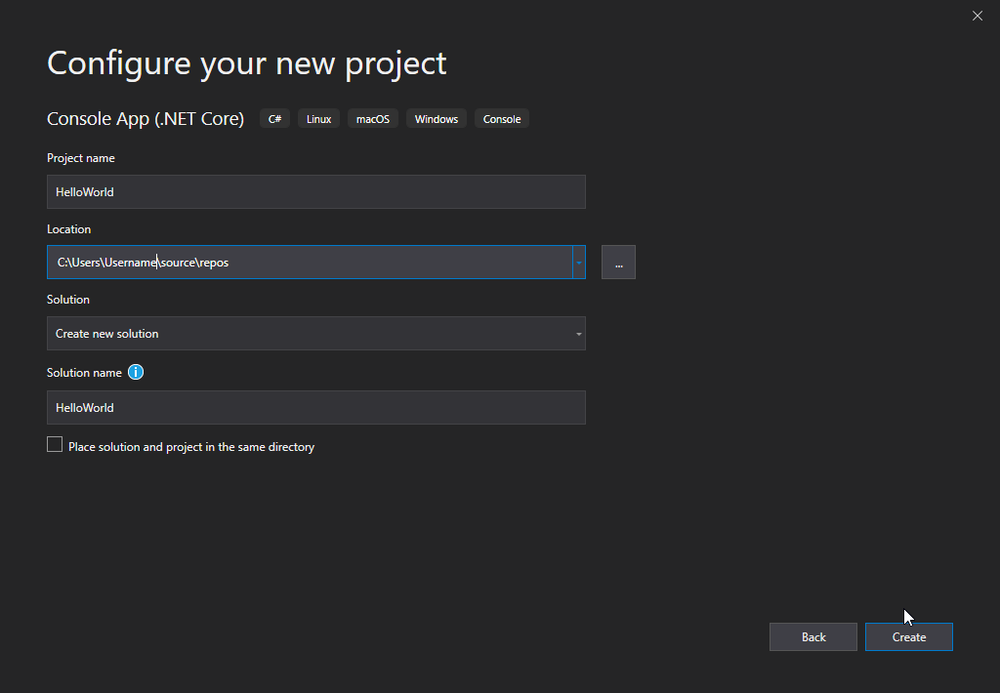

# Introduction to C#
C# is pronounced as "C-Sharp".
### Why C#:
C# is a modern object-oriented programming language that is portable and requires a .NET framework on a machine for it to run.

The performance of C# is exceptional in terms of speed and it can cheaply use resources.
Many applications can be created using C#. Some of these are given as follows:

- Web applications
- Networking applications
- Database applications
- Mobile application
- Games
- service applications 
- And so much more.


C# is a friendlier and easier language to understand for beginners compared to other programming languages. (e.g C and C++).

To get started, we need:
- An IDE(Integrated Development Environment) that is used to edit and compile code. In our case, we shall use Visual Studio which we can download from [here](https://visualstudio.microsoft.com/vs/community/).

Programs written in C# use the .NET Framework to run. .Net is a framework used to create applications easier and run the .Net software. In our tutorial, we need it to run our code.
.NET Framework was developed by Microsoft and runs primarily on Windows operating systems. There is an open-source project as well – it's called Mono which delivers a cross-platform.

### Installing C# 
Once you have downloaded and installed Visual Studio, choose .NET desktop development and click on the `Modify` button:


After the installation, click on the *launch* to get started.  

On the new window,choose *Create new project* : 


On the click, choose *"Install more tools and features"* then click *Next*:


Choose *"Console App (.NET Core)"* from the list and click *Next*:


Enter the name you would like to call your project and click *Create*. In this case, I will name my file as *HelloWorld*:



Visual Code will automatically generate some code of C# for you:


Let us look at the code.


Below is an example of the code that will be generated. It is a *Hello World* program.
```C#
using System;

namespace HelloWorld
{
class Program
{
static void Main(string[] args)
{
Console.WriteLine("Hello World!");
        }
    }
}
```


For you to run the program, you can press the *F5* key on your keyboard.
This will compile and run your code. A window console will pop with an output as below:

```
Hello World!

C:\Users\Username\source\repos\HelloWorld\HelloWorld\bin\Debug\netcoreapp3.0\HelloWorld.exe (process 13784) exited with code 0.
To automatically close the console when debugging stops, enable Tools->Options->Debugging->Automatically close the console when debugging stops.
Press any key to close this window . . .
```

### C# Syntax

From the above code, we created a program that prints out a *Hello World*. Let us understand each line while making some changes: 

```C#
//This is a C# program
using System;

namespace HelloWorld
{
class Program
{
static void Main(string[] args)
{
Console.WriteLine("Hello World!");
Console.ReadLine();
}
}
}
```
Here:


**Line 1:** 

```c#
//This is a C# program
```

The line starts with two forward slashes which makes it a comment. C# ignores the line when executing the code.
This is a single-line comment.

For multiple-line comment,we use ` /*`and ends with `*/`.

Any text between `/*` and `*/` will be ignored by C#. 

**Line 2:**
 ```C#
 using System
 ```

In C#, it means that we can use the classes available in the system. It contains commonly-used types and classes. 
You can explore more [here](https://docs.microsoft.com/en-us/dotnet/csharp/language-reference/keywords/using-directive).

**Line 3:**
 ```C#
 namespace HelloWorld{}
 ``` 

Namespaces are used in C# to organize and provide a level of separation of codes. It is a container that consists of classes, methods, and other namespaces.

**Line 4:**
 ``` C#
 class Program{}
 ```

Class is a container that contains data and methods.
Since C# is Object-oriented programming, creating a class is mandatory for each program. In our case, we are creating a class called Program.

**Line 5:** 
```C#
static void Main(string[] args)
```

Any program execution starts from the `Main` method.
Any code outside the main method will not be executed **unless** it is called.
Every program must have the `Main` method.

**Line 6:**
 ```C#
 Console.WriteLine("Hello World!");
 ```

`Console.WriteLine()` It is used to print out or output text on the console.
It prints a string and moves to the start of the next line.
In our case, it is used to output *"Hello World"*.

We can also use `Console.Write()` that print a string in the same line without moving to the next line.  To read more on Console.WriteLine() and Console.Write() visit [www.programiz.com](https://www.programiz.com/csharp-programming/basic-input-output).

**Line 7** 
```C#
Console.ReadLine();
```

`Console.ReadLine()` is used to read the next characters in the input system.
In the above program, as soon as the user enters a character(s) and presses the ENTER key, it terminates.

Another concept is `Console.Read()`that is used to read the next character in the input system.

```Console.ReadKey()``` It obtains the next key pressed by the user. It is mostly used to hold the console for the user until he presses a key.

**Note** 
> 
- Each line in C# ends with a semi-colon(;).
- C# follows a particular order when executing the program(top-bottom).
- C# is a case-sensitive language. Case sensitive language simply means that it treats lowercase and uppercase characters differently..e.g `program` and `Program` mean different things.

**Congratulations!** You just wrote your first C# program. 

Let's write another program whereby a user will be able to input two numbers and get the sum of the two numbers. 

```C#
//This is a C# program to add two numbers
using System;

namespace HelloWorld
{
class Program
{
static void Main(string[] args)
{
Console.WriteLine("Enter your first number: ");
int num1= Convert.ToInt32(Console.ReadLine());
Console.WriteLine("Enter your second number: ");
int num2= Convert.ToInt32(Console.ReadLine());
Console.WriteLine("Your Sum is "num1 + num2);//prints the sum of the two numbers 
Console.ReadLine();
        }
    }
}

```


Here's how your program output will look like:

```bash
Enter your first number: 2

Enter your second number: 5

Your Sum is 7
```

Let us look at the new things in our program:

```
int num1= Convert.ToInt32(Console.ReadLine());
```

```
int num1

```
 This means that we are creating a memory location to hold an integer (int). In our case, we have named the integer **num1**.

Just like integers, we have double data type which can store fractional numbers:
```C#
double num1;
```

```
Convert.ToInt32()

```
When we prompt the user to enter any details, C# takes the input as strings therefore, we have to convert the strings to numbers using the method above. 

```
Console.ReadLine()

```
 It takes data from the user and allocates it to the memory location we had created earlier. 


### Takeaways
>
In this article, we have learned:
- How to install C# 
- How to print out a hello World in C#
- The syntax of C#
- Adding of two numbers

We have also seen why we should start using C#. Most important, we have gone through the basics of C#, breaking down the line to line for better understanding.That's the basics of C#.